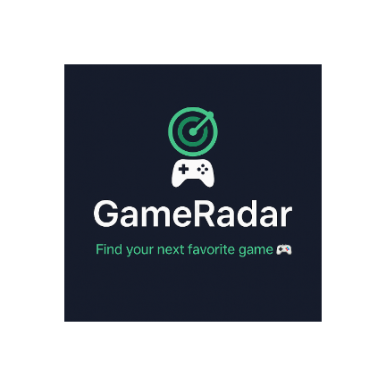
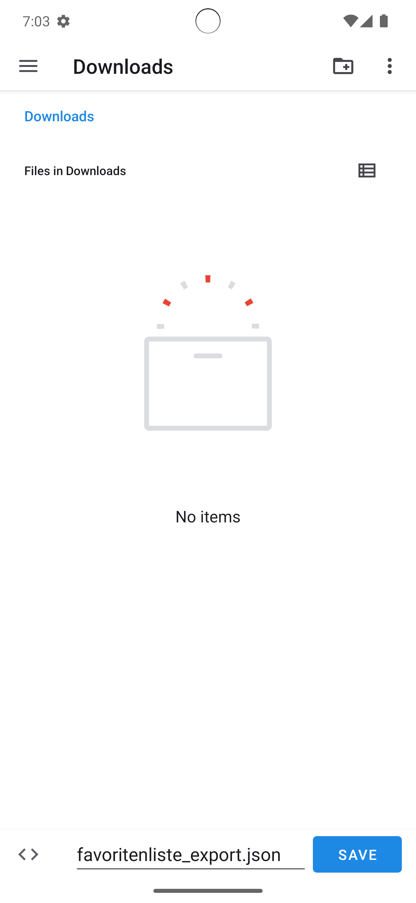

<!-- Projekt-Badges oben -->
<p align="center">
  
</p>

<h1 align="center" style="font-size: 2.8rem;">🎮 GameRadar 🎮</h1>

<p align="center">
  <a href="https://developer.android.com" target="_blank" rel="noopener noreferrer">
    
  </a>
  <a href="https://kotlinlang.org" target="_blank" rel="noopener noreferrer">
    
  </a>
  <a href="https://developer.android.com/jetpack/compose" target="_blank" rel="noopener noreferrer">
    
  </a>
  <a href="https://opensource.org/licenses/MIT" target="_blank" rel="noopener noreferrer">
    
  </a>
</p>

<p align="center">
  <!-- Optional: Demo Video Button -->
  <a href="https://your-demo-video-link-here" target="_blank" rel="noopener noreferrer" style="text-decoration:none; margin-right: 1rem;">
    📱 App Demo Video folgt in kürze!
  </a>

  <!-- Optional: APK Download Button -->
  <a href="https://github.com/jchillah/GameRadar/releases/download/GameRadarv1.0.0/GameRadar.apk" target="_blank" rel="noopener noreferrer" style="text-decoration:none;">
    📦 Download APK
  </a>
</p>

<meta name="description" content="GameRadar – Moderne Android-App zur Suche, Verwaltung und Analyse von Videospielen mit RAWG-API, Favoriten, Wunschliste, Filter, Statistiken, Export/Import und Jetpack Compose UI." />

<!-- Open Graph für bessere Vorschau bei Link-Sharing -->
<meta property="og:title" content="GameRadar – Videospiel-Such-App für Android" />
<meta property="og:description" content="Suche, favorisiere und analysiere über 350.000 Spiele mit RAWG-API. Modernes UI mit Jetpack Compose, Offline-Cache und mehr." />
<meta property="og:image" content="https://deine-domain.de/img/app_icon.png" />
<meta property="og:type" content="website" />
<meta property="og:url" content="https://deine-domain.de/" />

---

GameRadar ist eine moderne Android-App zur Suche, Verwaltung und Analyse von Videospielen. Die App
nutzt die RAWG-API und bietet Favoriten, Wunschliste, Filter, Statistiken, Export/Import und viele
Einstellungsmöglichkeiten.

## Highlights ✨

- **Edge-to-Edge-Design:** Inhalte beginnen direkt unter der Statusleiste, keine doppelten AppBars,
  keine verschachtelten Scaffold-Strukturen.
- **Konsistente UI:** Einheitliche Titelzeile mit Actions (Teilen, Favorit, Refresh) auf allen
  Hauptscreens.
- **Dark-/Light-Mode-Umschaltung:** Nutzer können das Design jederzeit in den Einstellungen
  wechseln.
- **Settings-Screen:** Alle App-Einstellungen (Design, Sprache, Bildqualität, Benachrichtigungen,
  etc.) zentral und MVVM-konform.
- **Fehlerbehandlung pro Feld:** Fehler wie „Keine Website verfügbar“ oder „Keine Screenshots
  verfügbar“ werden gezielt im jeweiligen Bereich angezeigt.
- **Null-Safety & Logging:** Alle Datenzugriffe sind null-sicher, Navigation und Datenübergaben
  werden geloggt.
- **Navigation nur mit primitiven Typen:** Es werden ausschließlich IDs oder Strings übergeben,
  keine komplexen Objekte.
- **Offline-First:** Favoriten und Detaildaten werden lokal mit Room gecacht.
- **Moderne Compose-Architektur:** Klare Trennung von UI, State und Logik, State-Hoisting, keine
  UI-Logik im ViewModel.

---

## Screenshots 🏞️

<p align="center">
  
  
  
  
  <br/>
  
  
  
  
</p>

---

## Features ➳

- 🔍 **Spielsuche:** Suche nach über 350.000 Spielen aus der RAWG-API
- 🏷️ **Filter & Sortierung:** Filter für Plattform, Genre, Bewertung und Release-Datum
- ⭐ **Favoriten & Wunschliste:** Speichere und verwalte deine Lieblingsspiele (Herz) und
  Wunschspiele (Stern). (Offline mit Room)
- 📝 **Detailseite:** Beschreibung, Galerie, Entwickler, Plattformen, Metacritic, Spielzeit,
  Screenshots und Trailer
- 🆕 **Listenansicht:** Neuerscheinungen & Top-rated
- 📤 **Spiele teilen:** via Link
- ⚡ **Offline-Cache:** für schnelle Anzeige & Fehlervermeidung
- 🎨 **Jetpack Compose UI:** modern, performant, flexibel
- 🏗️ **MVVM/MVI Hybrid-Architektur:** sauberes Repository-Pattern, State-Management und
  Intent-Handling
- ⏳ **Ladeindikator & Error-UI:** mit Retry-Funktion (zentralisierte Loading-Komponente)
- 🛡️ **Fehlerhinweise direkt im Feld:** (z. B. „Keine Screenshots verfügbar“)
- 📝 **Logging:** für Navigation und Datenübergabe
- 🌓 **Dark-/Light-Mode:** per Schalter im SettingsScreen
- ⚙️ **SettingsScreen:** Sprache, Bildqualität, Benachrichtigungen, Design, u.v.m.
- 🔄 **Export/Import:** Favoriten und Wunschliste als JSON exportieren/importieren (z. B. für Backup
  oder Gerätewechsel)
- 📊 **Statistiken & Charts:** Analyse deiner Spielvorlieben

---

## Technischer Aufbau 💻

### Architektur: MVVM/MVI Hybrid

- **MVVM:** Für klassische UI-Logik, State-Management und Datenbindung.
- **MVI:** Für komplexe Interaktionen wie Suche, Filter, Undo/Redo, Export/Import.
- **Repository-Pattern:** Klare Trennung von Datenquellen und UI.
- **Jetpack Compose:** Modernes, deklaratives UI-Framework für Android.

### Projektstruktur

```bash
de.syntax_institut.androidabschlussprojekt
├── data
│   ├── local         # Room: Entities, DAOs, DB, Models
│   ├── remote        # Retrofit DTOs + API-Service
│   └── repositories  # Kommunikation zwischen Datenquellen & Settings
├── domain           # Geschäftslogik, Domain-Modelle (z. B. Genre, Platform)
├── di               # Dependency Injection (Koin)
├── navigation       # Jetpack Navigation Komponenten
├── ui
│   ├── components   # Wiederverwendbare Composables (common, detail, search, settings)
│   ├── screens      # Hauptscreens (Search, Detail, Favorites, Settings)
│   ├── states       # UI-State-Modelle
│   ├── theme        # Farben, Typographie, Shapes
│   └── viewmodels   # ViewModel-Logik & UI-State
├── utils            # Hilfsklassen (z. B. Resource.kt, NetworkUtils)
└── services         # z. B. Background-Tasks
```

---

### Datenhaltung & API

- **Favoriten & Detail-Cache:** Offline verfügbar mit Room
- **RAWG Video Games API:**
  - Base URL: `https://api.rawg.io/api/`
  - Endpoints: `/games?search=...`, `/games/{id}`
  - Filter: Plattform, Genre, Bewertung, Datum
  - API-Key in `local.properties` eintragen
    ```bash
    API_KEY=YOUR_API_KEY
    ```

### Frameworks & Libraries

- **Retrofit** + **Moshi** für API
- **Room** für lokale Datenhaltung
- **Jetpack Compose** (UI) + Navigation
- **Coil** für Bild-Loading
- **Accompanist** für Paging & SwipeRefresh
- **Koin** für Dependency Injection
- **Firebase Crashlytics & Analytics** (optional)
- **Google AdMob** für Banner- und Rewarded-Ads

---

## Fehlerbehandlung & UX

- **Fehler pro Feld:** Website oder Screenshots fehlen? → ErrorCard nur im jeweiligen Bereich.  
  Echte API-/Netzwerkfehler? → Globale ErrorCard mit Retry
- **Null-Safety:** Alle Datenzugriffe sind null-sicher, keine Crashes durch fehlende Felder
- **Logging:** Navigation und Datenübergaben werden geloggt (z. B. gameId bei Detailaufruf)
- **Keine komplexen Objekte in Navigation:** Es werden nur primitive Typen (Int, String, Boolean)
  übergeben

---

## Werbung, Pro-Status & Rewarded Ads

- Die App verwendet Google AdMob für Banner- und Rewarded-Ads.
- **Nicht-Pro-User:** Werbung ist immer aktiviert, Statistiken und Export werden nach dem Ansehen
  einer Rewarded Ad freigeschaltet.
- **Pro-User:** Kann Werbung in den Einstellungen freiwillig aktivieren. Ist Werbung deaktiviert,
  sind Statistiken und Export immer verfügbar. Ist Werbung aktiviert, werden diese Features wie bei
  Nicht-Pro-Usern nach einer Rewarded Ad freigeschaltet.
- Es werden ausschließlich Test-IDs für AdMob verwendet (keine Gefahr für das AdMob-Konto beim
  Testen).

---

## Export/Import

- **Favoriten und Wunschliste können als JSON exportiert und importiert werden.**
- Die Funktion ist über die jeweiligen Screens erreichbar.
- Für den Export/Import kann eine Rewarded-Ad erforderlich sein (je nach Einstellung).

---

## Setup

1. **API Key** erstellen: [RAWG API Docs](https://rawg.io/apidocs)
2. Key in `local.properties` eintragen: `API_KEY=dein_key`
3. Projekt in Android Studio öffnen und ausführen

---

## Ausblick

- [x] Push-Notifikationen zu neuen Top-Spielen
- [x] Dark Mode (umschaltbar)
- [x] Vollbild-Screenshot-Galerie in Detailseite
- [x] Fehlerbehandlung pro Feld (statt global)
- [x] Logging für Navigation und Fehler
- [x] Erweiterte Paging-Unterstützung
- [x] SettingsScreen mit allen wichtigen App-Optionen(noch in Entwicklung)
- [x] Firebase-Integration für Sync & Analytics(noch in Entwicklung)

---

## Lizenz

MIT License – Siehe [LICENSE](LICENSE) für weitere Informationen.
