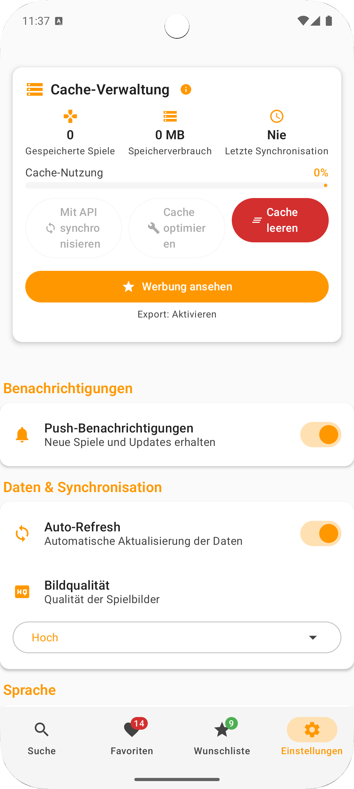

# Android Abschlussprojekt - Game Radar

Eine moderne Android-App zur Spiele-Suche, Verwaltung und Entdeckung – entwickelt mit Jetpack
Compose, MVVM und Clean Code Best Practices.

## Features

- **Spiele-Suche**: Durchsuche eine umfangreiche Spiele-Datenbank (RAWG API)
- **Favoriten**: Favoriten: Speichere und verwalte deine Lieblingsspiele lokal
- **Detailansicht**: Detaillierte Infos, Screenshots & Trailer zu jedem Spiel
- **Screenshots & Trailer**: Mediengalerien direkt in der App(Bilder und Videos zu den Spielen).
- **Dark Mode**: Modernes, dunkles Design
- **Cache- und Datenbank-Management**: Funktioniert auch ohne Internetverbindung
- **Benachrichtigungen**: Werde über neue Spiele informiert
- **Mehrsprachigkeit**: Deutsch, Englisch

## 🖼️ Screenshots

Hier ein Überblick über die wichtigsten App-Bereiche:

| Startscreen               | Suche                     | Detailansicht              |
|---------------------------|---------------------------|----------------------------|
|  |  |  |

| Favoriten                     | Einstellungen                     | Dark Mode                     | Fehlerfall                 |
|-------------------------------|-----------------------------------|-------------------------------|----------------------------|
|  |  |  |  |

## Debug-Anleitung: Fehlende Screenshots und Trailer

### Problem

Nach dem Neustart der App werden bei favorisierten Spielen keine Screenshots und Trailer mehr
angezeigt.

### Debug-Schritte

#### 1. Erweiterte Log-Ausgabe aktivieren

Die App wurde mit detaillierten Log-Ausgaben erweitert. Öffnen Sie Logcat in Android Studio und
filtern Sie nach:

```
FavoriteGameMapper
```

#### 2. Debug-Button verwenden

- Öffnen Sie ein Spiel in der Detailansicht
- Klicken Sie auf den roten Bug-Button (Debug-Button) in der oberen rechten Ecke
- Der Dialog zeigt aktuelle Spieldaten und Anweisungen

#### 3. Systematische Fehlerbehebung

1. **Favorisieren Sie ein Spiel** mit Screenshots/Trailern
2. **Prüfen Sie die Logcat-Ausgabe** beim Favorisieren
3. **Starten Sie die App neu**
4. **Öffnen Sie das favorisierte Spiel erneut**
5. **Vergleichen Sie die Logcat-Ausgaben** vor und nach dem Neustart

#### 4. Erwartete Logcat-Ausgaben

Beim Favorisieren sollten Sie sehen:

```
=== KONVERTIERUNG GAME → ENTITY ===
Screenshots Anzahl: X
Movies Anzahl: Y
✅ Screenshots JSON erfolgreich erstellt: [...]
✅ Movies JSON erfolgreich erstellt: [...]
```

Beim Laden aus der Datenbank:

```
=== KONVERTIERUNG ENTITY → GAME ===
✅ Screenshots erfolgreich geparst: X Elemente
✅ Movies erfolgreich geparst: Y Elemente
```

#### 5. Mögliche Ursachen

- **Leere Listen beim Favorisieren**: Das Problem liegt in der Datenbeschaffung
- **Fehlerhafte Serialisierung**: Das Problem liegt im Mapper
- **Fehlerhafte Deserialisierung**: Das Problem liegt beim Laden aus der Datenbank

### Technische Details

#### Datenbank-Schema

- `screenshots`: JSON-String mit Liste von Screenshot-URLs
- `movies`: JSON-String mit Liste von Movie-Objekten

#### Mapper-Logik

- **Serialisierung**: `List<String>` → JSON-String
- **Deserialisierung**: JSON-String → `List<String>`
- **Fallback-Mechanismen**: Bei Fehlern werden leere Listen verwendet

#### Repository-Logik

- Automatisches Nachladen vollständiger Details beim Favorisieren
- Fehlerbehandlung mit Fallback auf ursprüngliche Daten

## Installation

1. Klonen Sie das Repository
2. Öffnen Sie das Projekt in Android Studio
3. Fügen Sie Ihren API-Key in `local.properties` hinzu:
   ```
   API_KEY=ihr_api_key_hier
   ```
4. Bauen und starten Sie die App

## Technologie-Stack

- **UI**: Jetpack Compose
- **Architektur**: MVVM mit Repository Pattern
- **Datenbank**: Room
- **Networking**: Retrofit + Moshi
- **Dependency Injection**: Koin
- **Paging**: Android Paging 3
- **Navigation**: Compose Navigation

## API

Die App verwendet die [RAWG Video Games Database API](https://rawg.io/apidocs).

## Lizenz

Dieses Projekt ist für Bildungszwecke erstellt.

