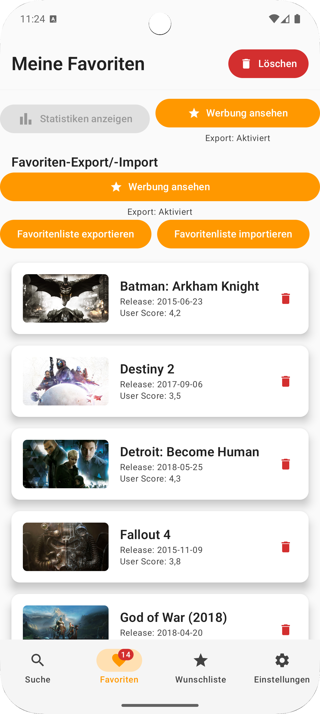
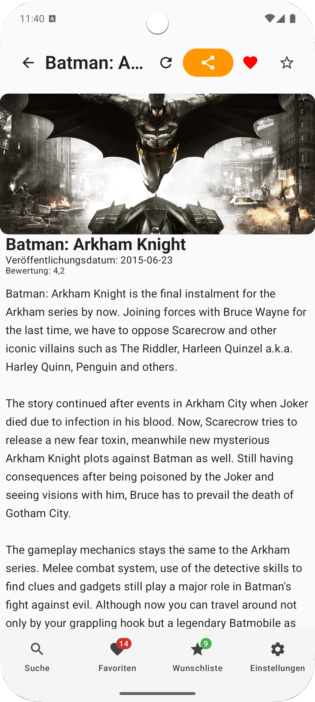
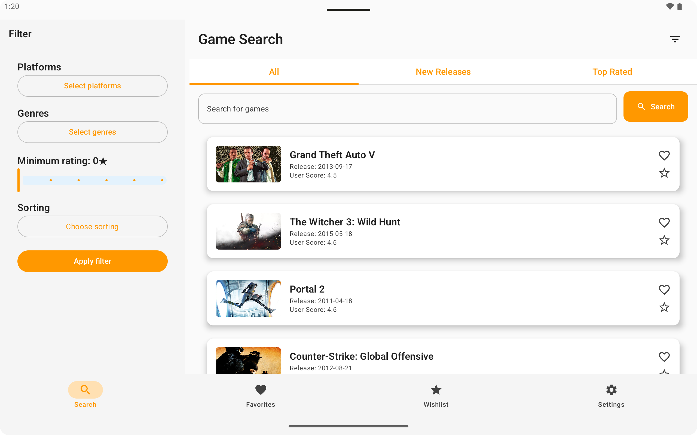
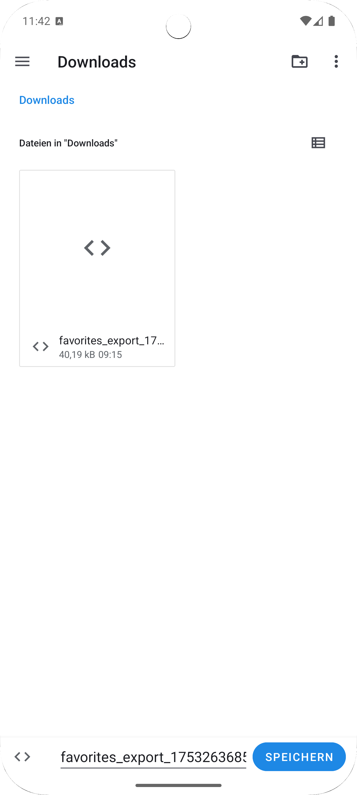

# GameRadar

GameRadar ist eine moderne Android-App zur Suche, Verwaltung und Analyse von Videospielen. Die App
nutzt die RAWG-API und bietet Favoriten, Wunschliste, Filter, Statistiken und viele
Einstellungsmöglichkeiten.

## Features

- Spiele-Suche mit Filter (Plattform, Genre, Bewertung)
- Favoritenverwaltung (mit Export/Import)
- Wunschliste (mit Export/Import)
- Spielstatistiken (Genres, Plattformverteilung, Favoritenanzahl)
- Responsive UI für Tablets, Foldables und Landscape
- Material3-Design
- App-Einstellungen: Analytics-Opt-In, Bildqualität, Theme-Wahl
- Offline-Cache
- Mehrsprachigkeit (Deutsch, Englisch)

## Ordnerstruktur

```
app/
  src/
    main/
      java/de/syntax_institut/androidabschlussprojekt/
        data/           # Datenhaltung, lokale/remote Quellen, Repositories
        domain/         # Domain-Modelle und UseCases
        di/             # Dependency Injection
        navigation/     # Navigation und Routen
        services/       # Hintergrunddienste
        ui/             # UI-Komponenten, Screens, ViewModels, States, Theme
        utils/          # Hilfsfunktionen, Logger, Analytics
      res/
        drawable/       # Icons und Bilder
        values/         # Strings, Farben, Themes
        xml/            # Backup/Restore-Regeln
    test/               # Unit- und UI-Tests
  img/                  # Screenshots
```

## Screenshots

| Suche                           | Favoriten                     | Wunschliste                       | Einstellungen                     |
|---------------------------------|-------------------------------|-----------------------------------|-----------------------------------|
|        |  |    |  |
|  |     |  |  |

## Installation

- Android Studio Hedgehog oder neuer
- RAWG-API-Key in `local.properties` eintragen: `RAWG_API_KEY=...any key...`
- Projekt öffnen und auf ein Gerät/Emulator ausführen

## Lizenz

MIT License

