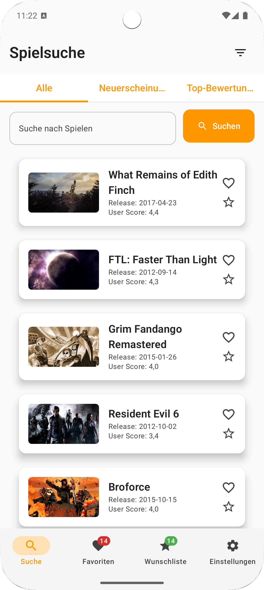
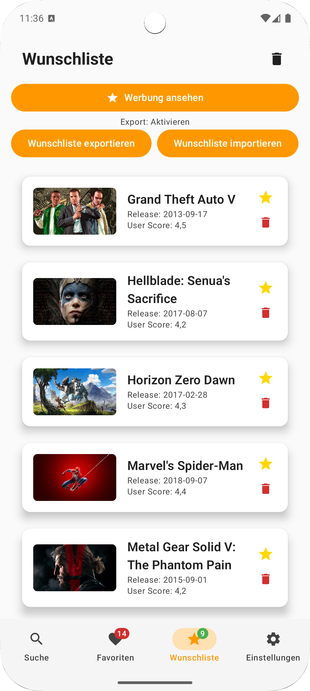

# GameRadar 🎮

**Finde dein nächstes Lieblingsspiel – entdecke, speichere und teile spannende Videospiele!**

GameRadar ist deine persönliche Game-Entdeckungsplattform für Android. Egal ob du nach den neuesten Spielen suchst, Klassiker nochmal erleben möchtest oder einfach neue Titel entdecken willst: Unsere App liefert dir Infos, Screenshots, Bewertungen und eine einfache Möglichkeit, deine Favoriten zu verwalten. GameRadar ist perfekt für Gamer:innen, die stets up to date bleiben wollen, ohne lange suchen zu müssen. Dabei ist die App intuitiv, schnell und optisch ansprechend gestaltet – für den optimalen Spielspaß.

---

## Design

  
  
  

---

## Features

- [ ] Spiele suchen und filtern nach Genre, Plattform und Bewertung  
- [ ] Detailansicht mit Screenshots, Beschreibung und Infos zum Spiel  
- [ ] Favoritenliste lokal speichern (Room Datenbank)  
- [ ] Neuerscheinungen und Top-Bewertungen anzeigen  
- [ ] Offline-Cache für favorisierte Spiele  

---

## Ausblick

- [ ] Spiele über soziale Netzwerke teilen  
- [ ] Benachrichtigungen zu neuen Spielen der Lieblingsgenres  
- [ ] Offline-Modus erweitern und Daten synchronisieren  
- [ ] User-Accounts und Cloud-Synchronisation mit Firebase  
- [ ] Erweiterte Filterfunktionen (Preis, Release-Datum)  
- [ ] Dark Mode und UI-Feinschliff  

---

## Technischer Aufbau

### Projektaufbau  
Die App folgt der MVVM-Architektur mit sauberer Trennung in drei Schichten:  
- `data` (API-Calls, Datenbank-Entities und Repository-Implementierung)  
- `domain` (Modelle und UseCases zur Geschäftslogik)  
- `presentation` (UI-Komponenten, ViewModels, Navigation mit Jetpack Compose)  

### Datenspeicherung  
Favoriten und zuletzt geladene Spieldaten werden lokal mit Room gespeichert, um schnelle Ladezeiten und Offline-Funktionalität zu ermöglichen. Room bietet eine stabile und performante Lösung mit einfacher Integration in Kotlin Coroutines.

### API Calls  
Die App verwendet die RAWG Video Games API (https://rawg.io/apidocs) für aktuelle Spieldaten, Bewertungen, Screenshots und weitere Metadaten. Retrofit mit Moshi wird für die API-Kommunikation eingesetzt.

### 3rd-Party Frameworks  
- Retrofit & Moshi (API-Integration)  
- Room (lokale Datenbank)  
- Coil (Bildladen)  
- Koin (Dependency Injection)  
- Jetpack Compose (UI)  

---

## Getting Started

1. RAWG API Key beantragen: https://rawg.io/apidocs  
2. App lokal bauen und starten  
3. Features nach und nach implementieren, Tickets im GitHub Project erstellen und zuweisen  
4. Regelmäßig pushen und Review-Termine wahrnehmen  

---

## Lizenz

Dieses Projekt ist lizenziert unter der MIT License – siehe LICENSE Datei für Details.
